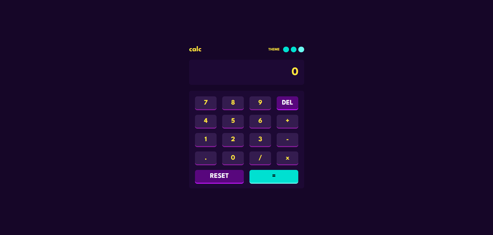
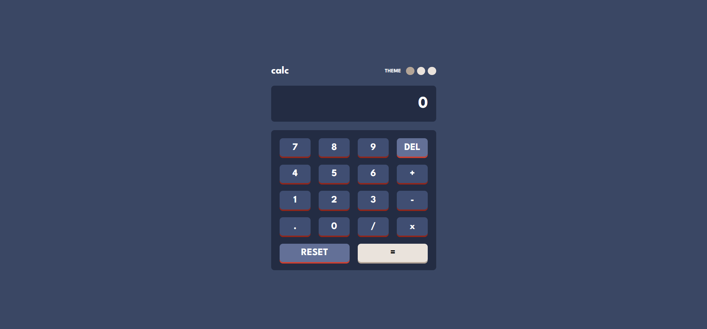
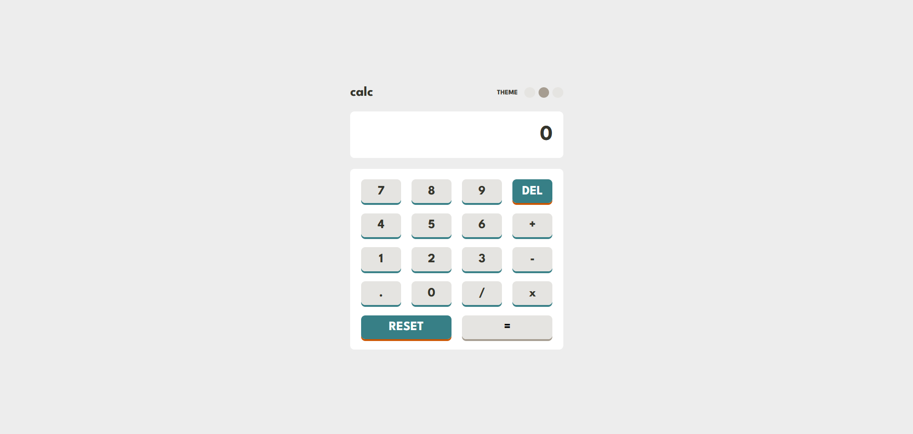

# Frontend Mentor - Calculator app solution

This is a solution to the [Calculator app challenge on Frontend Mentor](https://www.frontendmentor.io/challenges/calculator-app-9lteq5N29). Frontend Mentor challenges help you improve your coding skills by building realistic projects. 

## Table of contents

- [Overview](#overview)
  - [The challenge](#the-challenge)
  - [Screenshot](#screenshot)
  - [Links](#links)
- [My process](#my-process)
  - [Built with](#built-with)
  - [What I learned](#what-i-learned)
- [Author](#author)

**Note: Delete this note and update the table of contents based on what sections you keep.**

## Overview

### The challenge

Users should be able to:

- See the size of the elements adjust based on their device's screen size
- Perform mathmatical operations like addition, subtraction, multiplication, and division
- Adjust the color theme based on their preference
- **Bonus**: Have their initial theme preference checked using `prefers-color-scheme` and have any additional changes saved in the browser

### Screenshot

Preview





### Links

- Solution URL: [GitHub](https://your-solution-url.com)
- Live Site URL: [Live](https://your-live-site-url.com)

## My process

### Built with

- Semantic HTML5 markup
- CSS custom properties
- Flexbox
- CSS Grid
- JavaScript

### What I learned
I learned many new thing and used the switch functionality too for the first time. I had some trouble with the theme switcher while it's not perfect I got it to working for some level


```js
buttons.forEach(button => button.addEventListener("click", (e) => {
    const buttonText = e.target.id;

    if (buttonText >= "0" && buttonText <= "9" || buttonText === ".") {
        handleNumber(buttonText);
    } else if (buttonText === "+" || buttonText === "-" || buttonText === "/" || buttonText === "x") {
        handleOperator(buttonText);
    } else if (buttonText === "result-btn" || buttonText === "result") {
        handleResult();
    } else if (buttonText === "DEL" || buttonText === "del-btn") {
        handleDelete();
    } else if (buttonText === "reset-btn" || buttonText === "reset") {
        handleReset();
    }

    updateDisplay();
}));
```

I made the functions and I'm happy with the result

## Author

- Website - Induwara
- Frontend Mentor - [@induwara-thisarindu](https://www.frontendmentor.io/profile/induwara-thisarindu)
"# calculator-app" 
